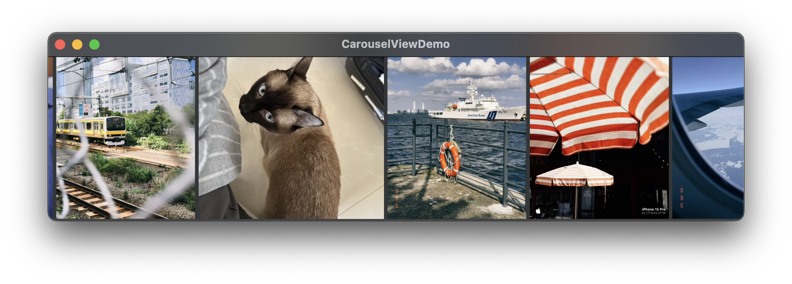

# Carousel for SwiftUI

A SwiftUI Carousel View and Layout, featuring:

- Infinite scrolling, implemented with SwiftUI's Layout protocol.
- No ScrollView is used/inspected. Drag gesture is implemented using SwiftUI's DragGesture.
- CADisplayLink is used to animate auto-scrolling. Animation can be started or stopped in runtime.
- Supports both vertical and horizontal orientation and switching between them in runtime.
- Clean SwiftUI style API.

Below is a low-frame GIF to demonstrate what visual effect it can achieve. To see the video demonstration, please refer to [here](https://github.com/JuniperPhoton/Carousel.SwiftUI/blob/main/Docs/carousel.mov).


This Library supports iOS 16+ and macOS 14+. Note that it internally uses `CADisplayLink` to drive animation, which is not available until macOS 14, although the `Layout` protocol is available since macOS 13.

> This Library is developed for my own app [PhotonCam](https://juniperphoton.dev/photoncam/) in production. It currently fit my needs, and pull requests or issues are also welcome.

## Installation

Add a dependency to this Swift Package in SPM:

```
https://github.com/JuniperPhoton/Carousel.SwiftUI
```

### Use `CarouselView`

`CarouselView` encapsulates both the `HCarouselLayout` and `VCarouselLayout` and provides a simple API to use. You can stack multiple `CarouselView` in a VStack or HStack to create multiple `CarouselView` just like the GIF/Video does above.



```swift
import Carousel

CarouselView(
    orientation: .horizontal,
    offset: controller.offset
) {
    ForEach(0..<assets.count) { index in
        Image(assets[index].resource)
            .resizeable()
            .scaledToFill()
            .frame(height: 100)
   }
}
```

The `offset` parameter controls the offset X (for horizontal) or the offset Y (for vertical) of the layout. The library provides a `CarouselController` to help you drive the animation.

```swift
import Carousel

@StateObject private var controller = CarouselController()

// Start
controller.startAnimation()

// Get the offset, which can be passed to the `CarouselView`.
let offset = controller.offset

// Stop
controller.stopAnimation()
```

By default, `CarouselController` uses `CADispalyLink` based method to drive the animation, you can also provide your own implementation by conforming to `DisplaySyncer` protocol and pass it to the initializer of `CarouselController`. See the initializer of `CarouselController` for more details.

To animate switching orientation of the `CarouselView`, you can simply declare the orientation as a state and change it within an animation transaction:

```swift
@State private var orientation: Axis = .horizontal

Button("Toggle Orientation") {
    withAnimation {
        orientation = orientation == .horizontal ? .vertical : .horizontal
    }
}
```

> The drag gesture feature is still in preview. Thus, by default, the drag gesture is disabled. To enable the drag gesture and get notification when its state changes, see the initializer of `CarouselView` for more details. 

### Use `HCarouselLayout` and `VCarouselLayout` directly

`HCarouselLayout` and `VCarouselLayout` are the `Layout` implementation of SwiftUI, so you can also use them directly. 

For example:

```swift
@StateObject private var controller = CarouselController()

VCarouselLayout(offset: controller.offset) {
    ForEach(0..<assets.count) { index in
        Image(assets[index].resource)
            .resizeable()
            .scaledToFill()
            .frame(height: 100)
    }
 }.onAppear {
     controller.startAnimation()
 }
 ```

### For UIKit and AppKit users

This library only provides SwiftUI implementation, but you can easily bridge it to UIKit and AppKit using the [`UIHostingController`](https://developer.apple.com/documentation/swiftui/uihostingcontroller) and [`NSHostingController`](https://developer.apple.com/documentation/swiftui/nshostingcontroller) APIs.

## Demo

Navigate and open `CarouselViewDemo/CarouselViewDemo.xcodeproj` in Xcode to run the demo.

## MIT License

Copyright (c) 2025 JuniperPhoton

Permission is hereby granted, free of charge, to any person obtaining a copy
of this software and associated documentation files (the "Software"), to deal
in the Software without restriction, including without limitation the rights
to use, copy, modify, merge, publish, distribute, sublicense, and/or sell
copies of the Software, and to permit persons to whom the Software is
furnished to do so, subject to the following conditions:

The above copyright notice and this permission notice shall be included in all
copies or substantial portions of the Software.

THE SOFTWARE IS PROVIDED "AS IS", WITHOUT WARRANTY OF ANY KIND, EXPRESS OR
IMPLIED, INCLUDING BUT NOT LIMITED TO THE WARRANTIES OF MERCHANTABILITY,
FITNESS FOR A PARTICULAR PURPOSE AND NONINFRINGEMENT. IN NO EVENT SHALL THE
AUTHORS OR COPYRIGHT HOLDERS BE LIABLE FOR ANY CLAIM, DAMAGES OR OTHER
LIABILITY, WHETHER IN AN ACTION OF CONTRACT, TORT OR OTHERWISE, ARISING FROM,
OUT OF OR IN CONNECTION WITH THE SOFTWARE OR THE USE OR OTHER DEALINGS IN THE
SOFTWARE.
